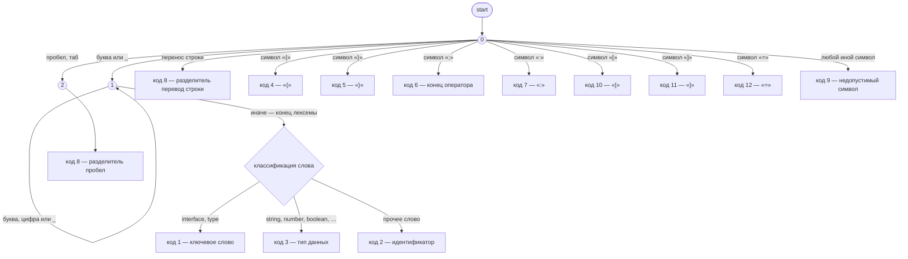
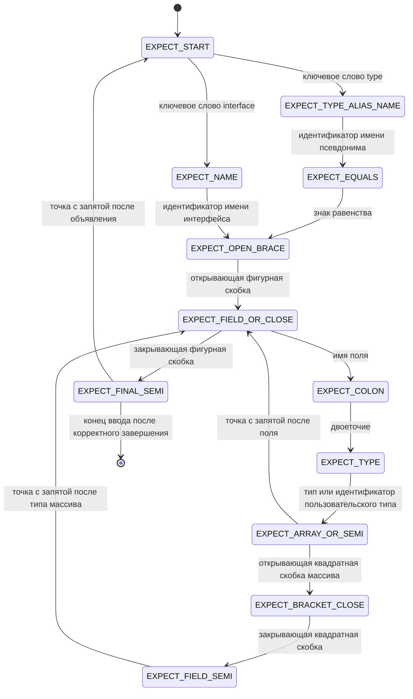

# Лабораторная работа 2. Лексический анализатор (сканер) и интеграция в GUI

## Цель работы

Изучить назначение и принципы работы лексического анализатора в структуре компилятора. Спроектировать алгоритм (диаграмму состояний) и выполнить программную реализацию сканера для выделения лексем из входного текста. Интегрировать разработанный модуль в ранее созданный графический интерфейс языкового процессора.

## Автор

Даниил

## Постановка задачи

**Цель:** разработать лексический анализатор (сканер) по индивидуальному варианту, встроить его в приложение из лабораторной работы №1 и обеспечить наглядный вывод результатов.

**Общие требования к сканеру:**

- принимать на вход строку (исходный текст);
- выделять все допустимые лексемы согласно варианту;
- классифицировать лексемы по типам;
- символы, не соответствующие ни одному допустимому типу, считать недопустимыми и выдавать ошибку с указанием позиции;
- учитывать многострочность входного текста.

**Требования к интеграции:**

- связать сканер с меню **«Пуск»** и соответствующим пунктом меню;
- выводить результаты в таблицу со столбцами: **условный код**, **тип лексемы**, **лексема**, **местоположение** (строка, начальная и конечная позиция);
- при щелчке по строке с ошибкой устанавливать курсор редактора на позицию ошибки.

В текущей реализации пункт меню **«Пуск → Лексический анализ»** (сочетание **Ctrl+Shift+L** / **Cmd+Shift+L**) запускает сканер по тексту активной вкладки; результаты отображаются на вкладке **«Лексемы»** нижней панели.

---

## Вариант задания

**Номер варианта:** *(укажите по заданию преподавателя).*

**Текстовое описание:** лексический анализ **объявлений `interface` и псевдонимов типа `type` с объектным типом** в стиле TypeScript.

- **`interface`** — ключевое слово, имя интерфейса, тело `{ ... }`.
- **`type Имя = { ... };`** — ключевое слово `type`, имя псевдонима, знак `=`, затем тот же объектный тип в фигурных скобках.

В обоих случаях тело — поля вида `имя: тип` с обязательной `;` после каждого поля; допускается `ИмяТипа[]`. После закрывающей `}` объявления ожидается `;`. Дополнительно выполняется **проверка последовательности токенов** (конечный автомат валидации): неверный порядок лексем, пропуск `;`, опечатки в ключевых словах, неизвестные встроенные типы и т. п. отображаются как отдельные лексемы с условным кодом ошибки.

**Ограничение:** после `=` в объявлении `type` поддерживается только **объектный тип** `{ ... }` (не `type X = string;`).

**Примеры корректных входных строк:**

```ts
interface Point { x: number; y: number; };
```

```ts
type Box = { w: number; h: number; };
```

```ts
interface User {
  name: string;
  age: number;
};
```

```ts
interface Node {
  value: string;
  children: Child[];
};
```

**Перечень допустимых лексем (условные коды):**

| Код | Тип лексемы (кратко) |
|-----|----------------------|
| 1 | ключевое слово (`interface`, `type`) |
| 2 | идентификатор |
| 3 | тип данных (встроенные: `string`, `number`, `boolean`, `any`, `unknown`, `object`, `void`, `null`, `undefined`) |
| 4 | разделитель `{` |
| 5 | разделитель `}` |
| 6 | конец оператора (`;`) |
| 7 | разделитель `:` |
| 8 | разделитель (пробел / перенос строки) |
| 9 | ошибка (недопустимый символ или нарушение структуры / последовательности) |
| 10 | разделитель `[` |
| 11 | разделитель `]` |
| 12 | оператор присваивания (`=`) |

Реализация: класс `ru.nstu.yopta.TypeScriptInterfaceScanner`, модель результата — `ru.nstu.yopta.Lexeme`.

---

## Диаграмма состояний

### 1. Сканер (выделение лексем из потока символов)

На каждом шаге из состояния **0** (начало лексемы) читается текущий символ. Цепочка **буква / `_`** переводит автомат в состояние **1**, где накапливается идентификатор или ключевое слово; при появлении символа, не входящего в идентификатор, лексема завершается и по таблице распознавания слова назначается **код 1** (`interface`, `type`), **код 3** (встроенные имена типов: `string`, `number`, …) или **код 2** (прочий идентификатор). Пробел и табуляция ведут в состояние **2** (пробельная цепочка) → **код 8**; символ перевода строки обрабатывается отдельно → **код 8**. Одиночные разделители `{ } ; : [ ] =` сразу дают **коды 4–7, 10–12** по таблице ниже. Любой другой символ → **код 9** (ошибка).

**Рисунок 1.** Лексический автомат для варианта «объявления `interface` / `type` с объектным типом» (соответствует реализации `TypeScriptInterfaceScanner`).



Условные коды в узлах совпадают с колонкой «Перечень допустимых лексем» выше.

После токенизации список лексем проходит **второй конечный автомат** — проверку допустимой последовательности для грамматик `interface` и `type Имя = { ... }` (состояния вида «ожидается `interface` или `type`», «ожидается `=`», «ожидается имя», «ожидается `:` после поля» и т. д.).

### 2. Автомат валидации объявлений `interface` и `type` с объектным типом



При несоответствии ожидаемого и фактического токена в таблицу добавляется лексема с кодом **9** и текстовым описанием ошибки; при необходимости выполняется восстановление (продолжение разбора), чтобы не накапливать ложные сообщения.

---

## Тестовые примеры

Формат вывода в приложении: **условный код | тип лексемы | лексема | местоположение** (для одной позиции: «строка *N*, *M*»; для диапазона: «строка *N*, *M*–*K*»).

### 1. Корректная однострочная строка

**Вход:**

```text
interface A { x: number; };
```

**Фрагмент выхода (значимые лексемы; пробелы дают отдельные строки с кодом 8):**

| Условный код | Тип лексемы | Лексема | Местоположение |
|--------------|-------------|---------|----------------|
| 1 | ключевое слово | interface | строка 1, 1–9 |
| 2 | идентификатор | A | строка 1, 11–11 |
| 4 | разделитель `{` | { | строка 1, 13–13 |
| 2 | идентификатор | x | строка 1, 15–15 |
| 7 | разделитель `:` | : | строка 1, 16–16 |
| 3 | тип данных | number | строка 1, 18–23 |
| 6 | конец оператора | ; | строка 1, 24–24 |
| 5 | разделитель `}` | } | строка 1, 25–25 |
| 6 | конец оператора | ; | строка 1, 26–26 |

*(Точные номера столбцов зависят от пробелов в строке.)*

### 2. Строка с недопустимым символом

**Вход:**

```text
interface T { a: string@; };
```

**Ожидаемо:** лексема с кодом **9**, тип «ошибка (недопустимый символ)», лексема `@`, местоположение — позиция символа `@`.

### 3. Многострочный пример

**Вход:**

```text
interface Box {
  w: number;
  h: number;
};
```

Сканер учитывает переводы строк: лексемы получают номера строк и столбцов по фактическому положению в тексте; переносы строк оформляются как лексемы типа «разделитель (перенос строки)» (код 8).

### 4. Нарушение последовательности (структурная ошибка)

**Вход (пропущена `;` после типа поля):**

```text
interface M {
  name: string
  age: number;
};
```

**Ожидаемо:** в таблице появляются лексемы с кодом **9** с сообщениями вида «ожидается `;` или `[` после типа» и т. п. (конкретный текст — в колонке «Тип лексемы»).

### 5. Объявление `type` с объектным типом

**Вход:**

```text
type Point = { x: number; y: number; };
```

**Фрагмент выхода (значимые лексемы):** после `type` (код 1) идут имя `Point` (2), `=` (12), `{` (4), поля в прежнем формате, затем `}` (5) и `;` (6). Тело `{ ... }` разбирается так же, как в `interface`.

**Смешанный файл:** допускается несколько объявлений подряд, например `interface I { };` затем `type T = { n: number; };` — после завершающей `;` первого объявления автомат снова ожидает `interface` или `type`.

---

## Используемые технологии

- **Язык:** Java 25  
- **GUI:** JavaFX 22  
- **Редактор кода:** RichTextFX 0.11.7  
- **Лексер (опционально для других подсистем):** JFlex 1.9.0 (генерация из `.flex`, если файлы присутствуют)  
- **Сборка:** Gradle 9.x  

## Инструкция по сборке и запуску

### Требования

- **JDK 25** (для сборки и запуска).

### Запуск

```bash
./gradlew run
```

На Windows:

```bat
gradlew.bat run
```

### Сборка

```bash
./gradlew build
```

## Кратко об интерфейсе (лабораторная №1 + №2)

- Редактор с вкладками, нижняя панель: **Терминал**, **Вывод**, **Сборка**, **Лексемы**.
- **Пуск → Лексический анализ** — запуск сканера; открывается вкладка **Лексемы** с таблицей результатов.
- Щелчок по строке с ошибкой (код 9) переводит курсор в редактор на соответствующую позицию.

Подробнее про оформление интерфейса: **[STYLING.md](STYLING.md)**.

## Ограничения

- Сохранение файлов — в кодировке UTF-8.
- Сканер ориентирован на описанное подмножество: объявления `interface`, объявления `type Имя = { ... };` с объектным типом; произвольный TypeScript не поддерживается (в том числе `type X = string;` без фигурных скобок).
