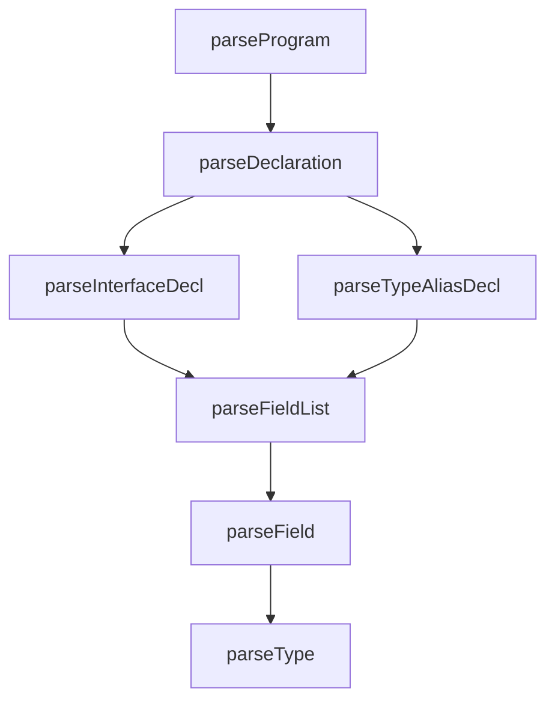
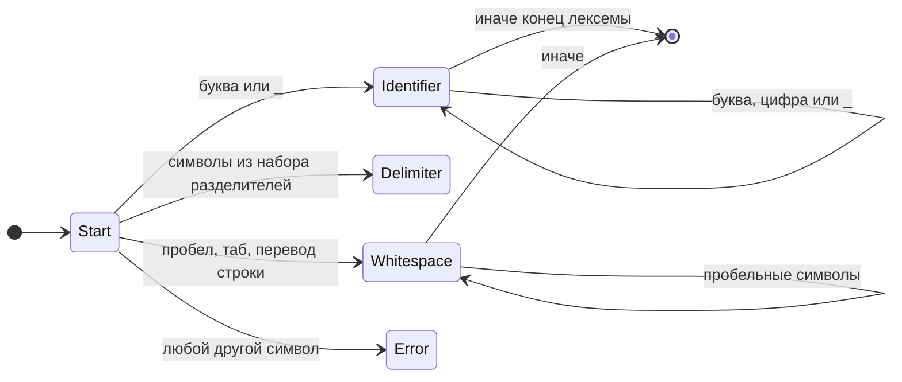

# Лабораторные работы 2–3. Лексический и синтаксический анализ, интеграция в GUI

## Цель работы

**ЛР3:** изучить синтаксический анализатор; спроектировать грамматику и схему метода разбора; реализовать парсер с нейтрализацией синтаксических ошибок **методом Айронса**; встроить модуль в приложение ЛР1 и вывести результаты в таблице с навигацией по ошибкам.

## Автор

Даниил

## Постановка задачи

**Цель:** разработать лексический анализатор (сканер) по индивидуальному варианту, встроить его в приложение из лабораторной работы №1 и обеспечить наглядный вывод результатов.

**Общие требования к сканеру:**

- принимать на вход строку (исходный текст);
- выделять все допустимые лексемы согласно варианту;
- классифицировать лексемы по типам;
- символы, не соответствующие ни одному допустимому типу, считать недопустимыми и выдавать ошибку с указанием позиции;
- учитывать многострочность входного текста.

**Требования к интеграции:**

- связать сканер с меню **«Пуск»** и соответствующим пунктом меню;
- выводить результаты в таблицу со столбцами: **условный код**, **тип лексемы**, **лексема**, **местоположение** (строка, начальная и конечная позиция);
- при щелчке по строке с ошибкой устанавливать курсор редактора на позицию ошибки.

В текущей реализации: **«Пуск → Лексический анализ»** — сканер по тексту активной вкладки, вкладка **«Лексемы»**; **«Пуск → Синтаксический анализ»** — парсер, вкладка **«Синтаксис»** (горячие клавиши см. в меню).

---

## Вариант задания

**Номер варианта:** *(укажите по заданию преподавателя).*

**Текстовое описание:** лексический анализ **объявлений `interface` и псевдонимов типа `type` с объектным типом** в стиле TypeScript.

- **`interface`** — ключевое слово, имя интерфейса, тело `{ ... }`.
- **`type Имя = { ... };`** — ключевое слово `type`, имя псевдонима, знак `=`, затем тот же объектный тип в фигурных скобках.

В обоих случаях тело — поля вида `имя: тип` с обязательной `;` после каждого поля; допускается `ИмяТипа[]`. После закрывающей `}` объявления ожидается `;`. **Структурная** корректность (порядок токенов, пропуск `;`, недопустимое имя типа и т. п.) проверяется **синтаксическим анализатором** (парсером); результаты — на вкладке **«Синтаксис»**.

**Ограничение:** после `=` в объявлении `type` поддерживается только **объектный тип** `{ ... }` (не `type X = string;`).

**Примеры корректных входных строк:**

```ts
interface Point { x: number; y: number; };
```

```ts
type Box = { w: number; h: number; };
```

```ts
interface User {
  name: string;
  age: number;
};
```

```ts
interface Node {
  value: string;
  children: Child[];
};
```

**Перечень допустимых лексем (условные коды):**

| Код | Тип лексемы (кратко) |
|-----|----------------------|
| 1 | ключевое слово (`interface`, `type`) |
| 2 | идентификатор |
| 3 | тип данных (встроенные: `string`, `number`, `boolean`, `any`, `unknown`, `object`, `void`, `null`, `undefined`) |
| 4 | разделитель `{` |
| 5 | разделитель `}` |
| 6 | конец оператора (`;`) |
| 7 | разделитель `:` |
| 8 | разделитель (пробел / перенос строки) |
| 9 | ошибка (**недопустимый символ** в исходном тексте; в таблице лексем) |
| 10 | разделитель `[` |
| 11 | разделитель `]` |
| 12 | оператор присваивания (`=`) |

Реализация лексера: `ru.nstu.yopta.TypeScriptInterfaceScanner` (`tokenize` / `scan`), модель лексемы — `ru.nstu.yopta.Lexeme`. Парсер: `ru.nstu.yopta.TypeScriptInterfaceParser`, диагностика — `ru.nstu.yopta.SyntaxDiagnostic`, результат — `ru.nstu.yopta.ParseResult`.

---

## Разработка грамматики (полное определение)

Терминалы соответствуют лексемам сканера (без пробелов; пробелы в потоке токенов игнорируются парсером). Нетерминалы выделены угловыми скобками.

```
Program        ::= { Declaration }
Declaration    ::= InterfaceDecl | TypeAliasDecl
InterfaceDecl  ::= "interface" Id "{" FieldList "}" ";"
TypeAliasDecl  ::= "type" Id "=" "{" FieldList "}" ";"
FieldList      ::= ε | Field FieldList
Field          ::= Id ":" Type ";"
Type           ::= TypeName ArraySuffix
TypeName       ::= встроенный_тип | пользовательский_идентификатор_типа
ArraySuffix    ::= ε | "[" "]"
```

Здесь **Id** — лексема с кодом идентификатора; **встроенный_тип** — лексема с кодом типа (`string`, `number`, …) или идентификатор, совпадающий с этими именами; **пользовательский_идентификатор_типа** — идентификатор, начинающийся с заглавной буквы (как в реализации). Иначе имя типа считается недопустимым и фиксируется ошибкой.

**Классификация по Хомскому:** грамматика относится к **типу 2 (контекстно-свободной)**: правила имеют вид \(A \to \alpha\), где \(A\) — один нетерминал.

---

## Метод синтаксического анализа

Реализован **рекурсивный спуск**: каждому нетерминалу соответствует процедура разбора; для списков полей — итерация или рекурсия по правилу `FieldList`.



Вход парсера — список лексем, полученный вызовом `TypeScriptInterfaceScanner.tokenize`.

---

## Диаграмма состояний сканера (лексика)

На каждом шаге читается символ; по нему определяется, начинается ли лексема (идентификатор, разделитель из набора `{ } ; : [ ] =`, пробельная последовательность) или зафиксирована ошибка. Идентификатор — последовательность букв, цифр и `_`, начинающаяся с буквы или `_`; слова `interface` и `type` классифицируются как ключевые слова.



---

## Диагностика и нейтрализация синтаксических ошибок (метод Айронса)

При обнаружении несоответствия ожидаемой и фактической лексеме формируется запись в таблице ошибок (фрагмент, позиция, текст пояснения). Затем выполняется **синхронизация** — пропуск токенов до одного из «безопасных» символов для данного контекста (паник-режим), после чего разбор продолжается, чтобы найти возможные дальнейшие ошибки и не останавливаться на первой:

- на уровне **файла** — до следующего `interface` / `type` или конца ввода;
- внутри **тела `{ ... }`** — до `;`, `}`, начала следующего объявления;
- после **ошибочного фрагмента типа** — до `;`, `[`, `}` или начала объявления.

При лексической ошибке (код 9 в потоке лексем) выдаётся сообщение о недопустимом символе, токен пропускается, при необходимости вызывается синхронизация внутри блока.

---

## Тестовые примеры

Формат вывода в приложении: **условный код | тип лексемы | лексема | местоположение** (для одной позиции: «строка *N*, *M*»; для диапазона: «строка *N*, *M*–*K*»).

### 1. Корректная однострочная строка

**Вход:**

```text
interface A { x: number; };
```

**Фрагмент выхода (значимые лексемы; пробелы дают отдельные строки с кодом 8):**

| Условный код | Тип лексемы | Лексема | Местоположение |
|--------------|-------------|---------|----------------|
| 1 | ключевое слово | interface | строка 1, 1–9 |
| 2 | идентификатор | A | строка 1, 11–11 |
| 4 | разделитель `{` | { | строка 1, 13–13 |
| 2 | идентификатор | x | строка 1, 15–15 |
| 7 | разделитель `:` | : | строка 1, 16–16 |
| 3 | тип данных | number | строка 1, 18–23 |
| 6 | конец оператора | ; | строка 1, 24–24 |
| 5 | разделитель `}` | } | строка 1, 25–25 |
| 6 | конец оператора | ; | строка 1, 26–26 |

*(Точные номера столбцов зависят от пробелов в строке.)*

### 2. Строка с недопустимым символом

**Вход:**

```text
interface T { a: string@; };
```

**Ожидаемо:** лексема с кодом **9**, тип «ошибка (недопустимый символ)», лексема `@`, местоположение — позиция символа `@`.

### 3. Многострочный пример

**Вход:**

```text
interface Box {
  w: number;
  h: number;
};
```

Сканер учитывает переводы строк: лексемы получают номера строк и столбцов по фактическому положению в тексте; переносы строк оформляются как лексемы типа «разделитель (перенос строки)» (код 8).

### 4. Нарушение последовательности (структурная ошибка)

**Вход (пропущена `;` после типа поля):**

```text
interface M {
  name: string
  age: number;
};
```

**Ожидаемо:** на вкладке **«Синтаксис»** после **«Пуск → Синтаксический анализ»** — таблица ошибок с описанием (например, ожидалась `;` после типа поля), счётчик ошибок; щелчок по строке выделяет фрагмент в редакторе.

### 5. Объявление `type` с объектным типом

**Вход:**

```text
type Point = { x: number; y: number; };
```

**Фрагмент выхода (значимые лексемы):** после `type` (код 1) идут имя `Point` (2), `=` (12), `{` (4), поля в прежнем формате, затем `}` (5) и `;` (6). Тело `{ ... }` разбирается так же, как в `interface`.

**Смешанный файл:** допускается несколько объявлений подряд, например `interface I { };` затем `type T = { n: number; };` — парсер обрабатывает последовательность объявлений по грамматике `Program`.

**Замечание:** пример из типового формуляра ЛР3 с выражением `const a = .001` относится к другому подмножеству языка; в данном варианте демонстрация ошибок — на конструкциях `interface` / `type` с объектным типом.

**Скриншоты:** вставьте снимки окна приложения с вкладками **«Лексемы»** и **«Синтаксис»** для корректного и некорректного примеров (по требованию методички).

---

## Используемые технологии

- **Язык:** Java 25  
- **GUI:** JavaFX 22  
- **Редактор кода:** RichTextFX 0.11.7  
- **Лексер (опционально для других подсистем):** JFlex 1.9.0 (генерация из `.flex`, если файлы присутствуют)  
- **Сборка:** Gradle 9.x  

## Инструкция по сборке и запуску

### Требования

- **JDK 25** (для сборки и запуска).

### Запуск

```bash
./gradlew run
```

На Windows:

```bat
gradlew.bat run
```

### Сборка

```bash
./gradlew build
```

## Кратко об интерфейсе (лабораторная №1 + №2 + №3)

- Редактор с вкладками, нижняя панель: **Терминал**, **Вывод**, **Сборка**, **Лексемы**, **Синтаксис**.
- **Пуск → Лексический анализ** — таблица лексем (код, тип, текст, местоположение); щелчок по строке с **лексической** ошибкой (код 9) — курсор на символ.
- **Пуск → Синтаксический анализ** — сообщение об отсутствии ошибок или таблица с колонками **Неверный фрагмент**, **Местоположение**, **Описание** и строкой **Общее количество ошибок**; щелчок по строке выделяет фрагмент в редакторе.

Подробнее про оформление интерфейса: **[STYLING.md](STYLING.md)**.

## Ограничения

- Сохранение файлов — в кодировке UTF-8.
- Сканер ориентирован на описанное подмножество: объявления `interface`, объявления `type Имя = { ... };` с объектным типом; произвольный TypeScript не поддерживается (в том числе `type X = string;` без фигурных скобок).
