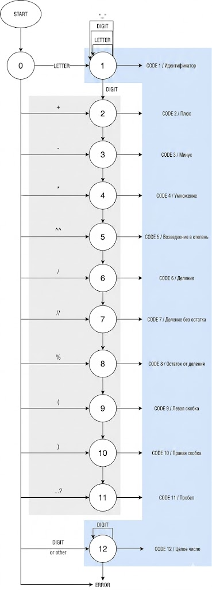
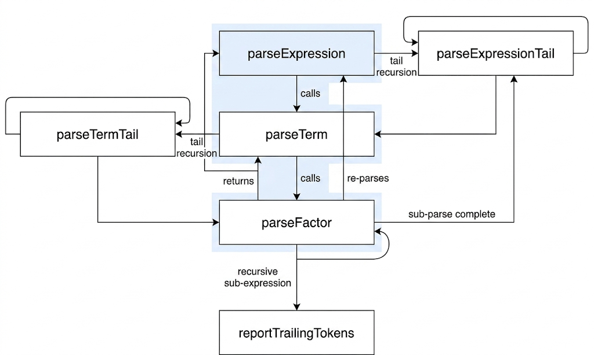
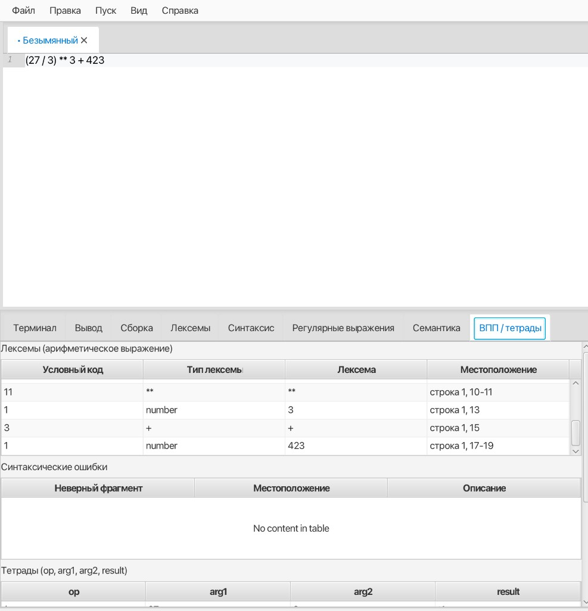
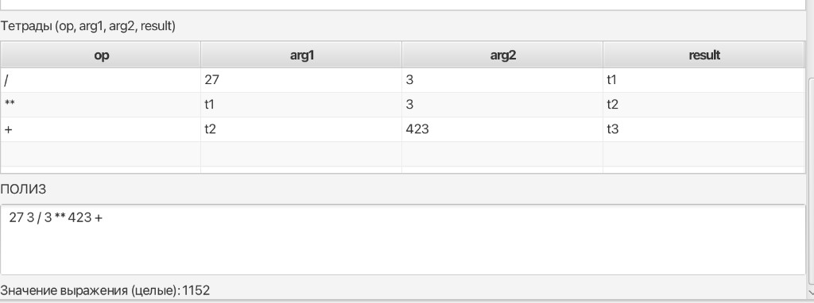
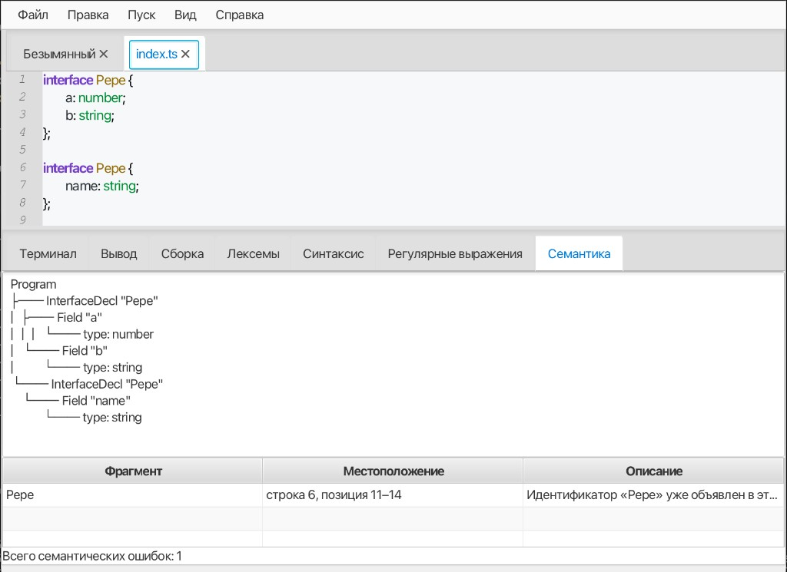

## Лабораторная работа 6. Внутреннее представление программы (тетрады, ПОЛИЗ)

**Название работы:** создание внутренней формы представления программы на примере арифметических выражений (тетрады и обратная польская запись).

**Выполнил:** Зохно Даниил Русланович

### Цель работы

Изучить построение ВПП по КС-грамматике, реализовать синтаксический анализ методом рекурсивного спуска, представить выражение в виде тетрад `(op, arg1, arg2, result)` и в ПОЛИЗ; для выражений **только из целых литералов** — вычислить значение (алгоритм сортировочной станции / Дейкстры).

### Вариант задания (ЛР6)

Мини-язык **арифметических выражений** (в редакторе — одна цепочка): операции `+`, `-`, `*`, `/`, `%`, возведение **`**`** (две звёздочки подряд — одна лексема), круглые скобки; литералы — последовательности цифр; идентификатор — **буква**, затем буквы, цифры, `_`, **`$`**. Иные символы — лексическая ошибка.

### КС-грамматика (формулировка из методички)

```
E → T A
A → ε | + T A | - T A
T → F B
B → ε | '*' F B | '/' F B | '%' F B | '**' F B
F → num | id | '(' E ')'
id → letter { letter | digit | _ | $ }
num → digit { digit }
```

Рекурсивный спуск в коде соответствует преобразованию: «хвост» `A` реализован циклом после первого `T`, хвост `B` — циклом после первого `F` (операции `* / % **` одного приоритета, выше чем `+` и `-`).

### Примеры верных цепочек

| Цепочка | Комментарий |
|---------|-------------|
| `(1+2)*3` | ПОЛИЗ для целых: `1 2 + 3 *`, значение `9` |
| `2+3*4` | Значение `14` |
| `2**10` | Возведение в степень, значение `1024` |
| `10%7` | Остаток, значение `3` |
| `a$b+1` | Идентификатор с символом `$` внутри имени |
| `x+y*z` | Идентификаторы в тетрадах; ПОЛИЗ и числовое значение по заданию только для **целых** без `id` |

### Лексические и синтаксические ошибки

- **Лексер:** `ArithmeticScanner` — число, идентификатор (в т.ч. `$` после первой буквы), операторы включая `%` и последовательность `**`, скобки; прочее — ошибка. Диаграмма в Javadoc класса.
- **Парсер:** `ArithmeticParser` — схема рекурсивного спуска по грамматике выше; сообщения о пропущенном операнде, незакрытой скобке, лишних символах после выражения.

При лексических или синтаксических ошибках **тетрады не формируются** (в интерфейсе — предупреждение и пустая таблица тетрад).

### Внутренняя форма и ПОЛИЗ

- Тетрады строятся при разборе; временные результаты `t1`, `t2`, … — см. классы `Quad`, `ArithmeticParser`.
- ПОЛИЗ (`ArithmeticPoliz`) и вычисление — **только** если в выражении нет идентификаторов (только целые литералы и операторы).

### Интеграция в IDE Yopta

**Пуск → Внутренняя форма (ЛР6)** (сочетание **Ctrl+Shift+I** / **⌘⇧I**): содержимое активной вкладки редактора обрабатывается как **одно** арифметическое выражение. Результат — вкладка **«ВПП / тетрады»**: таблицы лексем (режим ЛР6), синтаксических ошибок, тетрад, строка ПОЛИЗ и значение для целочисленного случая.

Тесты: `ArithmeticIrAnalysisTest`.

### Скриншоты для отчёта (методичка)







**Лексер (таблица лексем), окно IDE, выражение в редакторе** — корректная цепочка без синтаксических ошибок:



**Тетрады, ПОЛИЗ и значение** для выражения из целых литералов (пример: `(27 / 3) ** 3 + 423` → ПОЛИЗ `27 3 / 3 ** 423 +`, значение `1152`):



---

## Лабораторная работа 5. AST и семантический анализ (`interface` / `type`)

### Цель

Построить абстрактное синтаксическое дерево для распознанных объявлений и проверить контекстно-зависимые условия (уникальность имён, объявленность пользовательских типов).

### Вариант

Подмножество TypeScript: **`interface Имя { поля };`** и **`type Имя = { поля };`**, поля **`имя: тип;`**, тип — встроенный или пользовательский идентификатор с заглавной буквы, допускается **`[]`**.

### Узлы AST

| Узел | Описание |
|------|----------|
| `AstProgram` | Список объявлений верхнего уровня |
| `InterfaceDeclaration` | Имя (`Lexeme`) + список полей |
| `TypeAliasDeclaration` | Имя + поля (объектный тип) |
| `FieldDeclaration` | Имя поля + `TypeReference` |
| `NamedTypeReference` | Лексема имени типа |
| `ArrayTypeReference` | Вложенный тип + «массив» |

Текстовый вывод дерева: класс `AstPrinter` (отступы, символы `├──` / `└──`).

### Семантические правила (реализованы)

| Правило | Сообщение (ключ i18n) |
|---------|------------------------|
| Уникальность имён `interface` / `type` в одном файле | `semantic.err.duplicateDecl` |
| Уникальность имён полей внутри одного `{ ... }` | `semantic.err.duplicateField` |
| Пользовательский тип в поле должен быть объявлен (`interface` или `type`) в том же файле | `semantic.err.unknownType` |

Встроенные типы совпадают с лексикой (`string`, `number`, …). Ссылки на типы **вперёд** допустимы (два прохода по именам объявлений).

Правила методички про **совместимость типов значений** и **диапазоны числовых литералов** в данном подмножестве не применяются (нет литералов и инициализаторов полей).

### Интеграция

**Пуск → Семантический анализ** (горячая клавиша **Ctrl+Shift+M** / **⌘⇧M**): при отсутствии синтаксических ошибок выводится AST на вкладке **«Семантика»**, таблица семантических ошибок и строка **«Всего семантических ошибок: N»**; при синтаксических ошибках показывается предупреждение и вкладка **«Синтаксис»**.

Тесты: `SemanticAnalyzerTest`, разбор «сквозной» пример в `endToEndParseAndSemantics`.

### Схема дерева и скриншоты

Пример: два объявления `interface Pepe` — дерево AST и семантическая ошибка повторного объявления (`semantic.err.duplicateDecl`):



---

## Используемые технологии

- **Язык:** Java 25  
- **GUI:** JavaFX 22  
- **Редактор кода:** RichTextFX 0.11.7  
- **Лексер (опционально для других подсистем):** JFlex 1.9.0 (генерация из `.flex`, если файлы присутствуют)  
- **Регулярные выражения:** `java.util.regex` (ЛР4)  
- **AST и семантика:** собственная модель в пакете `ru.nstu.yopta.ast` (ЛР5)  
- **ВПП (тетрады, ПОЛИЗ):** `ArithmeticScanner`, `ArithmeticParser`, `ArithmeticPoliz` (ЛР6)  
- **Сборка:** Gradle 9.x  

## Инструкция по сборке и запуску

### Требования

- **JDK 25** (для сборки и запуска).

### Запуск

```bash
./gradlew run
```

На Windows:

```bat
gradlew.bat run
```

### Сборка

```bash
./gradlew build
```

## Кратко об интерфейсе (лабораторная №1–№6)

- Редактор с вкладками, нижняя панель: **Терминал**, **Вывод**, **Сборка**, **Лексемы**, **Синтаксис**, **Регулярные выражения**, **Семантика**, **ВПП / тетрады** (ЛР6).
- **Пуск → Лексический анализ** — таблица лексем (код, тип, текст, местоположение); щелчок по строке с **лексической** ошибкой (код 9) — курсор на символ.
- **Пуск → Синтаксический анализ** — сообщение об отсутствии ошибок или таблица с колонками **Неверный фрагмент**, **Местоположение**, **Описание** и строкой **Общее количество ошибок**; щелчок по строке выделяет фрагмент в редакторе.
- **Пуск → Семантический анализ** — текст AST и таблица семантических ошибок (после успешного синтаксиса).
- **Пуск → Поиск по регулярным выражениям** — выбор типа поиска (целое число / ФИО / пароль), таблица совпадений и счётчик; щелчок по строке выделяет найденный фрагмент в редакторе.
- **Пуск → Внутренняя форма (ЛР6)** — для **арифметического** выражения в редакторе: лексемы, ошибки синтаксиса, тетрады (если цепочка корректна), ПОЛИЗ и значение для целых литералов.

Подробнее про оформление интерфейса: **[STYLING.md](STYLING.md)**.

## Ограничения

- Сохранение файлов — в кодировке UTF-8.
- Сканер ориентирован на описанное подмножество: объявления `interface`, объявления `type Имя = { ... };` с объектным типом; произвольный TypeScript не поддерживается (в том числе `type X = string;` без фигурных скобок).
- Команда **«Внутренняя форма (ЛР6)»** разбирает весь текст вкладки как **одно** арифметическое выражение (для отчёта по ЛР6 введите в редактор только выражение, без объявлений TypeScript).
