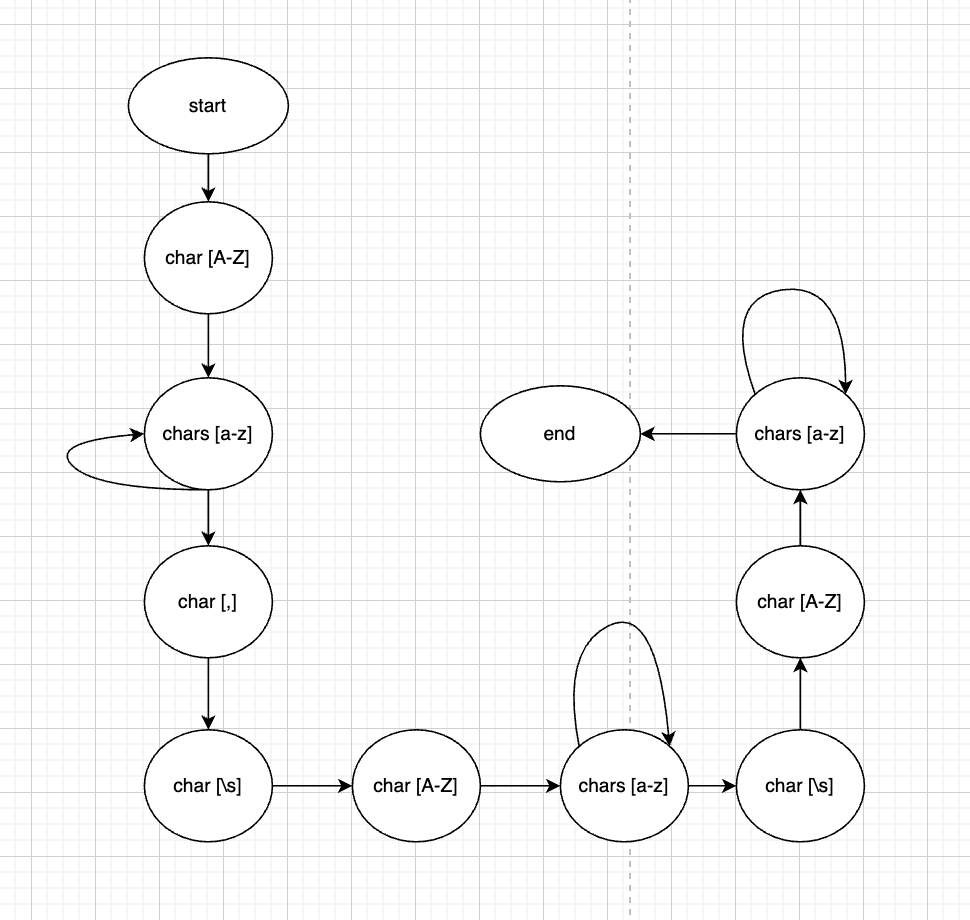
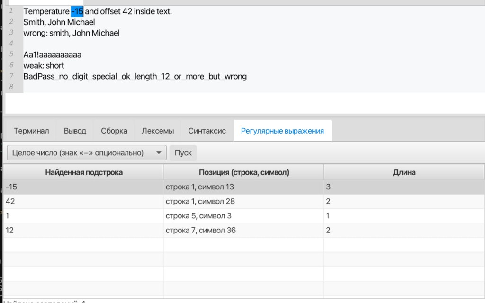
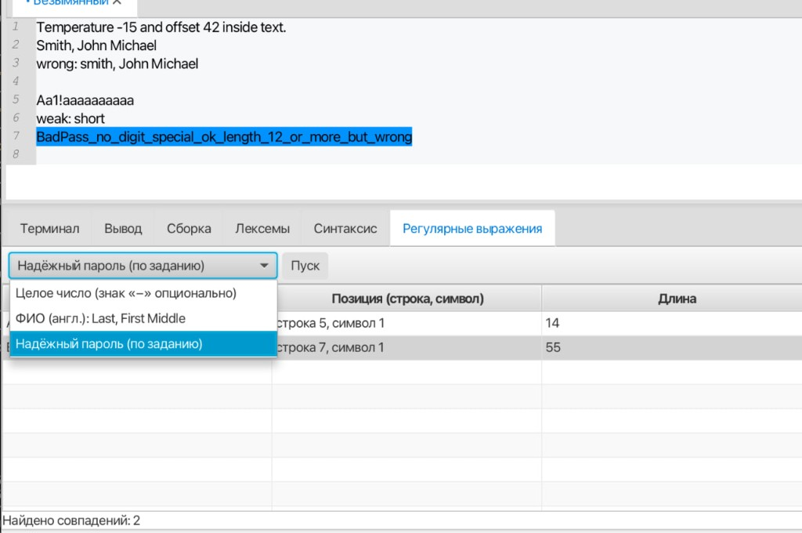

## Лабораторная работа 4. Поиск подстрок по регулярным выражениям

### Цель

Изучить основы регулярных выражений и их использование для поиска и извлечения фрагментов текста; интегрировать поиск в графический интерфейс текстового редактора.

### Постановка задачи

В модуль добавлены выпадающий список типа поиска, кнопка **«Пуск»**, вкладка **«Регулярные выражения»** с таблицей результатов (найденная подстрока; строка и символ начала; длина), счётчик совпадений; пункт меню **«Пуск → Поиск по регулярным выражениям»** (горячая клавиша **Ctrl+Shift+X** / **⌘⇧X**). При выборе строки таблицы соответствующий фрагмент выделяется в редакторе. Пустой текст редактора — сообщение «Нет данных для поиска».

Тесты: `./gradlew test`, класс `RegexSearchTest`.

Пример смешанного текста для ручной проверки: [`src/test/resources/lab4_sample.txt`](src/test/resources/lab4_sample.txt).

### Вариант (три задачи)

#### 1. Целое число (со знаком или без)

**Регулярное выражение:** `-?[0-9]+`

| Фрагмент | Значение |
|----------|----------|
| `-?` | минус **нуль или один раз** (отрицательное число или без знака) |
| `[0-9]` | одна десятичная цифра |
| `+` | предыдущий элемент **один или более раз** |

**Должны находиться:** `0`, `42`, `-7`, `-128`.

**Не должны:** `12.3`, `abc`, только `-`.

---

#### 2. ФИО на английском в формате *Last, First Middle*

**Регулярное выражение:** `^[A-Z][a-z]*,\s+[A-Z][a-z]*\s+[A-Z][a-z]*$` с флагом **MULTILINE** (`Pattern.MULTILINE` в Java): `^` и `$` относятся к **началу и концу каждой строки**, а не ко всему тексту.

**Доп. задание (поиск через автомат):** для этой задачи реализован поиск подстрок (строк целиком) через конечный автомат, соответствующий регулярному выражению.

Граф автомата:



| Фрагмент | Значение |
|----------|----------|
| `^` | начало строки |
| `[A-Z]` | одна заглавная латинская буква |
| `[a-z]*` | ноль или более строчных латинских букв |
| `,` | запятая |
| `\s+` | один или более пробельных символов |
| `$` | конец строки |

**Должны находиться (целиком строка):** `Smith, John Michael`.

**Не должны:** `smith, John Michael` (фамилия не с заглавной); строка без запятой в нужном месте; имя из одной буквы без фамилии в формате задания.

**Тестовые примеры поиска (реализация автоматом, с местоположением):**

Вход:

```text
x
Smith, John Michael
z
```

Ожидаемый результат:

- Найденная подстрока: `Smith, John Michael`
- Начальная позиция: **строка 2, символ 1**
- Длина: **18**

---

#### 3. Надёжный пароль

Требования: длина не менее **12** символов; хотя бы одна **заглавная** и одна **строчная** английские буквы; хотя бы одна **цифра**; хотя бы один **спецсимвол** из набора `/ # ? ! @ _ $ % ^ & * \| \ -`; без **пробелов и прочих пробельных символов** в строке пароля (`\S`).

**Регулярное выражение:** `^(?=.*[A-Z])(?=.*[a-z])(?=.*[0-9])(?=.*[/#?!@_$%^&*|\\-])\S{12,}$` с флагом **MULTILINE**.

| Фрагмент | Значение |
|----------|----------|
| `(?=.*[A-Z])` | **позитивная проверка вперёд:** дальше по строке есть заглавная буква |
| `(?=.*[a-z])` | есть строчная буква |
| `(?=.*[0-9])` | есть цифра |
| `(?=.*[...])` | есть символ из перечисленного класса (в JVM в строке литерала `\` удваивается) |
| `\S{12,}` | не менее 12 символов **без пробелов** |
| `^` `$` | границы **одной строки** при MULTILINE |

**Должны находиться (отдельной строкой):** например `Aa1!aaaaaaaaaa`, `Str0ng#PassOk99`.

**Не должны:** короче 12 символов; без спецсимвола из списка; строка с пробелом внутри.

---

**Скриншоты**

Поиск целых чисел (`-?[0-9]+`):



Поиск надёжного пароля:



В Markdown картинка вставляется так: `` — путь считается от файла `README.md` в корне репозитория.

---

## Используемые технологии

- **Язык:** Java 25  
- **GUI:** JavaFX 22  
- **Редактор кода:** RichTextFX 0.11.7  
- **Лексер (опционально для других подсистем):** JFlex 1.9.0 (генерация из `.flex`, если файлы присутствуют)  
- **Регулярные выражения:** `java.util.regex` (ЛР4)  
- **Сборка:** Gradle 9.x  

## Инструкция по сборке и запуску

### Требования

- **JDK 25** (для сборки и запуска).

### Запуск

```bash
./gradlew run
```

На Windows:

```bat
gradlew.bat run
```

### Сборка

```bash
./gradlew build
```

## Кратко об интерфейсе (лабораторная №1 + №2 + №3)

- Редактор с вкладками, нижняя панель: **Терминал**, **Вывод**, **Сборка**, **Лексемы**, **Синтаксис**, **Регулярные выражения**.
- **Пуск → Лексический анализ** — таблица лексем (код, тип, текст, местоположение); щелчок по строке с **лексической** ошибкой (код 9) — курсор на символ.
- **Пуск → Синтаксический анализ** — сообщение об отсутствии ошибок или таблица с колонками **Неверный фрагмент**, **Местоположение**, **Описание** и строкой **Общее количество ошибок**; щелчок по строке выделяет фрагмент в редакторе.
- **Пуск → Поиск по регулярным выражениям** — выбор типа поиска (целое число / ФИО / пароль), таблица совпадений и счётчик; щелчок по строке выделяет найденный фрагмент в редакторе.

Подробнее про оформление интерфейса: **[STYLING.md](STYLING.md)**.

## Ограничения

- Сохранение файлов — в кодировке UTF-8.
- Сканер ориентирован на описанное подмножество: объявления `interface`, объявления `type Имя = { ... };` с объектным типом; произвольный TypeScript не поддерживается (в том числе `type X = string;` без фигурных скобок).
